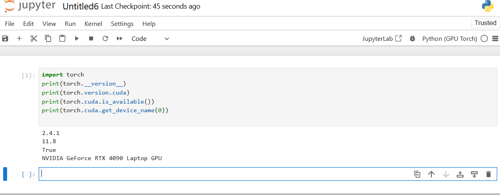

---


# ✅ Full Guide: Running Jupyter Notebook on GPUs

This guide helps you set up Jupyter Notebook with GPU support using Anaconda, CUDA, cuDNN, and deep learning libraries like PyTorch or TensorFlow.

---

## ⚙️ Step 1: Install Anaconda

- Download and install from:  
  👉 [https://www.anaconda.com/products/distribution](https://www.anaconda.com/products/distribution)

- After installation, launch Jupyter Notebook via:
```bash
jupyter notebook
```

This opens Jupyter Notebook in your browser.

---

## ⚙️ Step 2: Install CUDA Toolkit

CUDA enables your Python libraries (e.g., TensorFlow, PyTorch) to run on NVIDIA GPUs.

- Download from:  
  👉 [https://developer.nvidia.com/cuda-downloads](https://developer.nvidia.com/cuda-downloads)

- Choose the version that matches:
  - Your **GPU model**
  - Your **Operating System**

- To verify your GPU details:
```bash
nvidia-smi
```

---

## ⚙️ Step 3: Install cuDNN Library

cuDNN accelerates deep learning on GPUs.

- Download from:  
  👉 [https://developer.nvidia.com/cudnn](https://developer.nvidia.com/cudnn)

- Match cuDNN version with your installed CUDA version.

After downloading:
- Extract the files.
- Copy `bin/`, `lib/`, and `include/` folders into your CUDA installation directory (usually `/usr/local/cuda/` on Linux).

> ⚠️ cuDNN must be manually installed — not via conda/pip.

---

## ⚙️ Step 4: Create a Conda Environment (Python 3.8)

```bash
conda create --name gpu_env python=3.8
conda activate gpu_env
```

---

## ⚙️ Step 5: Install Required Packages

Choose one of the following options depending on your framework preference:

### 🧠 Option A: TensorFlow + Keras (GPU-enabled)
```bash
conda install -c anaconda tensorflow-gpu keras-gpu
```

### 🔥 Option B: PyTorch (GPU-enabled, recommended)
```bash
conda install pytorch torchvision torchaudio pytorch-cuda=11.8 -c pytorch -c nvidia
```

> ⚠️ Replace `11.8` with your actual CUDA version.

### ➕ Optional: Add data science packages
```bash
conda install jupyter numpy pandas matplotlib scikit-learn
```

---

## ⚙️ Step 6: Configure Jupyter to Use GPU Environment

```bash
python -m ipykernel install --user --name gpu_env --display-name "Python (GPU)"
```

✅ This registers the environment as **"Python (GPU)"** in the Jupyter kernel list.

---

## 🚀 Step 7: Launch Jupyter Notebook

```bash
jupyter notebook
```

- Click **New Notebook**
- Choose the **"Python (GPU)"** kernel

---

## ✅ Step 8: Verify GPU is Being Used

Run this in a notebook cell:
```python
import torch
torch.cuda.is_available()
```

**Expected Output:**
```python
True
```

If `True`, your environment is GPU-enabled. 🎉

---

## 🧠 Quick Troubleshooting

| Problem                            | Fix                                                                 |
|------------------------------------|----------------------------------------------------------------------|
| `torch.cuda.is_available()` is `False` | Make sure CUDA and cuDNN are properly installed                     |
| Kernel not showing in Jupyter     | Ensure you ran the `ipykernel install` command                       |
| Version mismatch / compatibility  | Match TensorFlow or PyTorch to your CUDA version                    |
| Model runs slow                   | Check if code is accidentally running on CPU (`torch.device("cuda")`) |

---


Once you configure the versions of CUDA, cudnn and jupyter, you go over steps 7 and 8 again and you should find your notebook running on GPU.


